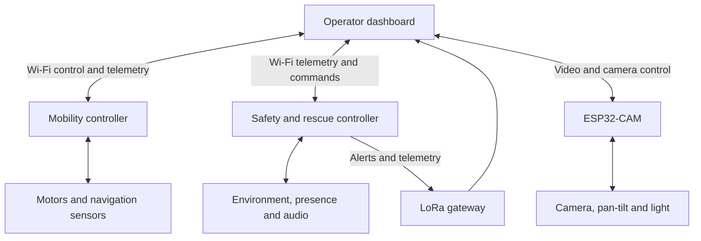

[README(1).md](https://github.com/user-attachments/files/32174164/README.1.md)

# MINERAKSHA AI ROVER

### AI-Powered Underground Mine Safety, Monitoring and Rescue System

**Send the robot first. Save human rescuers. Save trapped workers faster.**

  
  
  

  <a href="#overview">Overview</a> ·
  <a href="#capabilities">Capabilities</a> ·
  <a href="#system-architecture">Architecture</a> ·
  <a href="#hardware">Hardware</a> ·
  <a href="#development-status">Status</a> ·
  <a href="#roadmap">Roadmap</a>

**Robotics &nbsp; / &nbsp; Embedded Systems &nbsp; / &nbsp; Sensor Fusion &nbsp; / &nbsp; Rescue Technology**

---

## Overview

**MINERAKSHA** is a compact robotic scout being developed to help rescue teams understand hazardous environments before sending people inside. It brings together remote mobility, environmental sensing, live video, obstacle awareness, and potential victim detection in a modular rover platform.

The project focuses on a critical question: **What is happening inside, and how can rescuers approach it with better information?**

By sending observations back to an operator dashboard, MINERAKSHA aims to reduce blind entry and support faster, better-informed rescue decisions.

| Project | Details |
| :--- | :--- |
| **Team** | POLYGENESIS |
| **Event** | Smart India Hackathon 2026 |
| **Problem statement** | SIH26039 |
| **Department / organization** | Government of Jharkhand |
| **Theme** | Smart Automation |
| **Category** | Hardware |
| **Stage** | Working prototype V1; integration and validation ongoing |

## The Problem

Underground incidents can leave rescuers facing poor visibility, uncertain passage conditions, hazardous air, and limited information about trapped workers. Entering without a reliable picture of the environment can expose rescue personnel to the same risks as the people they are trying to reach.

MINERAKSHA is designed to gather that first layer of information remotely:

- **Environmental conditions** — gas-sensor readings and temperature observations.
- **Route conditions** — nearby obstacles and rover orientation.
- **Visual context** — a live camera view with remotely adjustable pan and tilt.
- **Possible human presence** — radar and other observations that help direct operator attention.

> **MINERAKSHA turns blind rescue into informed rescue — the rover takes the first risk, so humans don’t have to.**

## Capabilities

The following describes the V1 design scope. Individual modules and the complete system remain subject to integration testing.

| Capability | Purpose |
| :--- | :--- |
| **Remote mobility** | Let an operator drive the rover while monitoring conditions from a safer location. |
| **Environmental monitoring** | Collect gas-sensor and temperature data to support hazard awareness. |
| **Live video & pan–tilt** | Inspect the surrounding area and adjust the camera view remotely. |
| **Obstacle awareness** | Use short-range distance measurements to support movement through constrained spaces. |
| **Presence sensing** | Use LD2420 radar observations as an additional cue for possible human presence. |
| **Audio support** | Integrate a microphone and speaker for listening and communication. |
| **Operator dashboard** | Bring rover control, telemetry, alerts, and camera access into one interface. |
| **Wi-Fi & LoRa communication** | Use Wi-Fi for local data and video, with LoRa included for low-bandwidth alerts and telemetry. |
| **Rule-based assessment** | Combine sensor observations into hazard and potential-victim indicators. |
| **Emergency stop** | Include a hardware stop mechanism in the rover control design. |

### What “AI” Means in V1

V1 uses **rule-based sensor fusion and scoring** to help prioritize observations for the operator. Gas, temperature, distance, and presence inputs contribute to situational awareness.

These indicators support human judgment. They do not establish that a route is safe or confirm a survivor. Learned perception models and more advanced autonomy are future development areas.

## System Architecture

The design separates mobility, safety sensing, and vision across dedicated controllers. This makes it easier to develop and troubleshoot each subsystem before combining them.

**Architecture note:** This is a functional overview. Controller pin assignments, sensor routing, and multiplexer selection depend on the wiring revision used for the build.

## Hardware

The project hardware spans the following subsystems. This overview is not a pin-level wiring guide or a finalized bill of materials.

| Subsystem | Components referenced in the project | Role |
| :--- | :--- | :--- |
| **Control** | ESP32 development boards | Mobility control and safety/rescue processing |
| **Vision** | ESP32-CAM, SG90 servos | Video capture and camera pan–tilt |
| **Drive** | Motor driver, four geared DC motors | Rover movement |
| **Distance sensing** | Four VL53L0X ToF sensors, HC-SR04 | Short-range obstacle measurements |
| **Orientation** | IMU / gyroscope | Rover attitude and motion feedback |
| **Air sensing** | MQ-series gas sensors, including MQ-135; ADS1115 ADC | Acquisition of gas-sensor signals |
| **Temperature** | Temperature sensor | Environmental temperature monitoring |
| **Presence sensing** | HLK-LD2420 radar | Human-presence cues |
| **Audio** | Microphone, speaker and supporting audio electronics | Listening and voice communication |
| **Radio** | LoRa modules and gateway | Low-bandwidth telemetry and alerts |
| **Power & visibility** | Battery, regulated supply rails, lights / beacon | System power, illumination, and indication |

## Operator Experience

The dashboard is intended to give the operator a connected view of the rover and its surroundings:

1. **Connect** to the rover’s control, telemetry, and camera endpoints.
2. **Inspect** incoming readings, connection state, and the video feed.
3. **Explore** using remote drive and camera controls.
4. **Assess** hazard and presence indicators alongside raw observations.
5. **Respond** by stopping, repositioning, or reporting findings to the rescue team.

The project dashboard includes configurable WebSocket endpoints and demonstration data modes. Demonstration values must be clearly distinguished from live sensor readings.

### Operating Modes

| Mode | Intended behavior |
| :--- | :--- |
| **Manual** | The operator directly controls rover movement. |
| **Assisted** | The operator drives with sensor feedback and movement assistance. |
| **Semi-auto** | Limited automated behavior operates under operator supervision. |

Mode availability and behavior depend on the firmware build and connected hardware. V1 should not be described as fully autonomous.

## Development Status

| Area | Current project position |
| :--- | :--- |
| **Physical platform** | Working prototype V1 |
| **Dashboard** | Dashboard code exists with configurable endpoints and demonstration modes |
| **Camera firmware** | Camera sketch includes video, pan, tilt, and light control |
| **Intelligence** | Rule-based hazard and potential-victim scoring |
| **Wiring** | Revision 4 documented; bench validation pending |
| **System validation** | End-to-end reliability and field performance remain to be established |

> **Prototype scope:** MINERAKSHA is a research and hackathon prototype. It has not been established as certified mine-rescue equipment or validated for deployment in explosive atmospheres.

## Build & Bring-Up

Use the wiring documentation and firmware that correspond to the **same hardware revision**. A reproducible installation guide requires the repository’s actual firmware files, dependencies, board settings, and dashboard entry point.

The intended bring-up sequence is:

1. **Identify the build revision.** Match controller roles, components, and wiring before connecting modules.
2. **Prepare the controllers.** Configure each firmware module for its board, peripherals, and network settings.
3. **Check modules individually.** Establish communication with mobility, environmental sensing, presence sensing, and the camera.
4. **Configure the dashboard.** Set the endpoints for the connected modules and select live data for hardware testing.
5. **Integrate the rover.** Verify that commands, readings, video, and alerts correspond to the physical system.
6. **Record results.** Document observed behavior, faults, and fixes for the exact tested revision.

<!-- Maintainer: Add exact installation commands, dependency versions, firmware paths,
board settings, and dashboard launch instructions once the repository layout is finalized.
Keep credentials and private network details out of committed files. -->

## Roadmap

- [ ] Complete bench validation of Wiring Revision 4.
- [ ] Improve camera connection stability and recovery.
- [ ] Validate integrated telemetry, alerts, and operator controls.
- [ ] Calibrate environmental sensors and document interpretation limits.
- [ ] Evaluate presence-detection behavior under representative conditions.
- [ ] Validate emergency-stop and communication-loss behavior.
- [ ] Measure runtime, communication performance, and mobility limits.
- [ ] Publish reproducible setup instructions and test results.
- [ ] Explore mapping, thermal imaging, and more advanced perception.

## Potential Applications

**Underground mine safety and rescue** is the primary focus. Future adaptation could support scouting in collapsed structures, tunnels, confined spaces, and industrial incident areas.

Each environment introduces different mechanical, sensing, communication, and protection requirements; suitability must be evaluated separately.

## Contributing

Contributions that improve prototype reliability, documentation, and reproducibility are welcome.

- **Firmware:** controller stability, communication recovery, and sensor integration.
- **Dashboard:** clear telemetry, connection feedback, controls, and accessibility.
- **Hardware:** documented wiring revisions, power design, and mechanical improvements.
- **Validation:** reproducible test procedures, measured results, and issue reports.

When reporting an issue, include the hardware revision, firmware version, steps to reproduce, expected behavior, observed behavior, and relevant logs. For a proposed change, explain the problem it solves and how it was checked.

<!-- Maintainer: Add a license section after choosing and committing the project LICENSE.
Preserve the applicable license and attribution notices for any third-party code included. -->

---

**Developed by Team POLYGENESIS**

Smart India Hackathon 2026 · SIH26039 · Smart Automation

**Send the robot first.**

